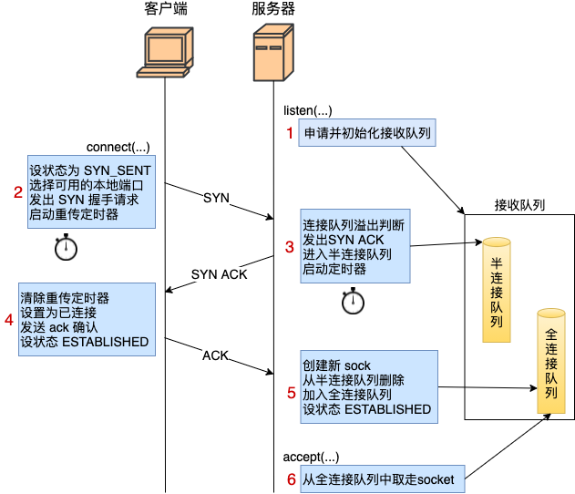

# Tcp握手流程  
1. 在服务器 listen 的时候，主要是进行了全/半连接队列的长度限制计算，以及相关的内存申请和初始化。
2. 客户端在 connect 的时候，把本地 socket 状态设置成了 TCP_SYN_SENT，选了一个可用的端口，接着发出 SYN 握手请求并启动重传定时器。
3. 服务器响应 ack 是主要工作是判断下接收队列是否满了，满的话可能会丢弃该请求，否则发出 synack。申请 request_sock 添加到半连接队列中，同时启动定时器。
4. 客户端响应来自服务器端的 synack 时清除了 connect 时设置的重传定时器，把当前 socket 状态设置为 ESTABLISHED，开启保活计时器后发出第三次握手的 ack 确认。
5. 服务器响应第三次握手 ack 所做的工作是把当前半连接对象删除，创建了新的 sock 后加入到全连接队列中，最后将新连接状态设置为 ESTABLISHED。
6. accept 从已经建立好的全连接队列中取出一个返回给用户进程。

