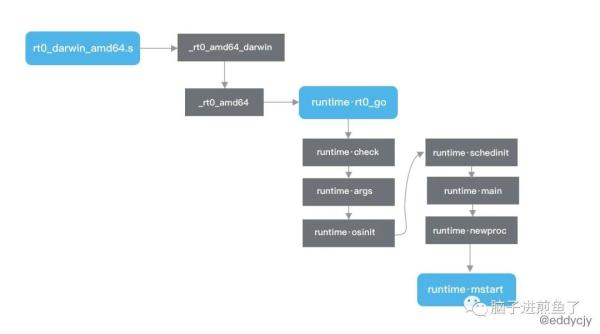

# Go 引导阶段  
## 流程概述
1. 程序从rt0_linux_amd64.s 开始；
2. 首先执行_rt0_amd64_linux方法，跳转到_rt0_amd64方法。该方法将程序输入的argc和argv从内存移动到寄存器中；
3. 紧接着跳转到runtime.rt0_go方法；
4. 在runtime.rt0_go方法会进行大量初始化任务
   - runtime.check：运行时类型检查；
   - runtime.args：将系统参数转换传递给程序使用；
   - runtime.osinit：获取 CPU 核心数和内存物理页大小；
   - runtime.schedinit：初始化调度器、内存分配器、堆、栈、GC、P 等组件。并将 m0 和某个 p 绑定；
   - runtime.mainPC：指向 runtime.main，运行 main goroutine；
   - runtime.newproc：新建一个 goroutine，且绑定 runtime.main 方法。并将其放入 m0 绑定的p的本地队列中去，以便后续调度；
   - runtime.mstart：启动 m，调度器开始进行循环调度；
5. runtime.mstart：开启调度器
   - 调用 getg 方法获取 GMP 模型中的 g，此处获取的是 g0；
   - 通过检查 g 的执行栈 \_g_.stack 的边界(堆栈的边界正好是 lo, hi)来确定是否为系统栈。若是，则根据系统栈初始化 g 执行栈的边界；
   - 调用 mstart1 方法启动系统线程 m，进行调度器循环调度；
   - 调用 mexit 方法退出系统线程 m；
6. runtime.mstart1：启动系统线程 m，开始调度
   - 调用 getg 方法获取 g。并且通过前面绑定的 \_g_.m.g0 判断所获取的 g 是否 g0。若不是，则直接抛出致命错误。因为调度器仅在 g0 上运行。
   - 调用 minit 方法初始化 m，并记录调用方的 PC、SP，便于后续 schedule 阶段时的复用。
   - 若确定当前的 g 所绑定的 m 是 m0，则调用 mstartm0 方法，设置信号 handler。该动作必须在 minit 方法之后，这样 minit 方法可以提前准备好线程，以便能够处理信号。
   - 若当前 g 所绑定的 m 有启动函数，则运行。否则跳过。
   - 若当前 g 所绑定的 m 不是 m0，则需要调用 acquirep 方法获取并绑定 p，也就是 m 与 p 绑定。
   - 调用 schedule 方法进行正式调度。

## 入口文件  
1. 真正的程序入口在 runtime 包中，不同的计算机架构指向不同。例如：
    1. MacOS 在 src/runtime/rt0_darwin_amd64.s
    2. Linux 在 src/runtime/rt0_linux_amd64.s
2. 文件解读
    1. rt0 代表 runtime0 的缩写，指代运行时
    2. darwin/linux 代表目标操作系统(GOOS)
    3. amd64 代表目标操作系统架构(GOHOSTARCH)
    4. 同时 Go 语言还支持更多的目标系统架构，例如：AMD64、AMR、MIPS、WASM 等
## 入口方法
1. 在 rt0_darwin_amd64.s 文件中，可发现 _rt0_amd64_darwin JMP 跳转到了 _rt0_amd64 方法：  
    1. TEXT _rt0_amd64_darwin(SB),NOSPLIT,$-8   
    2. JMP _rt0_amd64(SB) 
2. _rt0_amd64方法将程序输入的 argc 和 argv 从内存移动到寄存器中；栈指针(SP)的前两个值分别是 argc 和 argv，其对应参数的数量和具体各参数的值。紧接着又跳转到 runtime·rt0_go 方法。
    1. TEXT _rt0_amd64(SB),NOSPLIT,$-8 
    2. MOVQ 0(SP), DI // argc 
    3. LEAQ 8(SP), SI // argv 
    4. JMP runtime·rt0_go(SB) 
## 开启主线  
1. 程序参数准备就绪后，正式初始化的方法落在 runtime·rt0_go 方法中：  
    TEXT runtime·rt0_go(SB),NOSPLIT,$0   
    ...   
    CALL runtime·check(SB)   
    MOVL 16(SP), AX  // copy argc   
    MOVL AX, 0(SP)   
    MOVQ 24(SP), AX  // copy argv   
    MOVQ AX, 8(SP)   
    CALL runtime·args(SB)   
    CALL runtime·osinit(SB)   
    CALL runtime·schedinit(SB)   
    // create a new goroutine to start program   
    MOVQ $runtime·mainPC(SB), AX  // entry   
    PUSHQ AX   
    PUSHQ $0   // arg size   
    CALL runtime·newproc(SB)   
    POPQ AX   
    POPQ AX    
    // start this M   
    CALL runtime·mstart(SB)   
    ...   

2. 函数解释
    - runtime.check：运行时类型检查，主要是校验编译器的翻译工作是否正确，是否有 “坑”。基本代码均为检查 int8 在 unsafe.Sizeof 方法下是否等于 1 这类动作。
    - runtime.args：系统参数传递，主要是将系统参数转换传递给程序使用。
    - runtime.osinit：系统基本参数设置，主要是获取 CPU 核心数和内存物理页大小。
    - runtime.schedinit：进行各种运行时组件的初始化，包含调度器、内存分配器、堆、栈、GC 等一大堆初始化工作。会进行 p 的初始化，并将 m0 和某一个 p 进行绑定。
    - runtime.main：主要工作是运行 main goroutine，虽然在runtime·rt0_go 中指向的是$runtime·mainPC，但实质指向的是 runtime.main。
    - runtime.newproc：创建一个新的 goroutine，且绑定 runtime.main 方法(也就是应用程序中的入口 main 方法)。并将其放入 m0 绑定的p的本地队列中去，以便后续调度。
    - runtime.mstart：启动 m，调度器开始进行循环调度。
    - 在 runtime·rt0_go 方法中，其主要是完成各类运行时的检查，系统参数设置和获取，并进行大量的 Go 基础组件初始化。

3. 初始化完毕后进行主协程(main goroutine)的运行，并放入等待队列(GMP 模型)，最后调度器开始进行循环调度。

## 引导过程总结  
  
1. 在 Go 语言中，实际的运行入口并不是用户日常所写的 main func，更不是 runtime.main 方法，而是从 rt0_*_amd64.s 开始，最终再一路 JMP 到 runtime·rt0_go 里去，再在该方法里完成一系列 Go 自身所需要完成的绝大部分初始化动作。
2. 其中整体包括：
    - 运行时类型检查、系统参数传递、CPU 核数获取及设置、运行时组件的初始化(调度器、内存分配器、堆、栈、GC 等)。
    - 运行 main goroutine。
    - 运行相应的 GMP 等大量缺省行为。
    - 涉及到调度器相关的大量知识。

# Go 调度器初始化  
## runtime.mstart:  
        func mstart() {   
            // 获取 g0   
            _g_ := getg()    
            // 确定栈边界   
            osStack := _g_.stack.lo == 0   
            if osStack {   
                size := _g_.stack.hi   
                if size == 0 {   
                    size = 8192 * sys.StackGuardMultiplier   
                }   
                _g_.stack.hi = uintptr(noescape(unsafe.Pointer(&size)))   
                _g_.stack.lo = _g_.stack.hi - size + 1024   
            }   
            _g_.stackguard0 = _g_.stack.lo + _StackGuard   
            _g_.stackguard1 = _g_.stackguard0   
            // 启动 m，进行调度器循环调度   
            mstart1()   
            // 退出线程   
            if mStackIsSystemAllocated() {   
                osStack = true   
            }   
            mexit(osStack)   
        }   
- 调用 getg 方法获取 GMP 模型中的 g，此处获取的是 g0。
- 通过检查 g 的执行栈 \_g_.stack 的边界(堆栈的边界正好是 lo, hi)来确定是否为系统栈。若是，则根据系统栈初始化 g 执行栈的边界。
- 调用 mstart1 方法启动系统线程 m，进行调度器循环调度。
- 调用 mexit 方法退出系统线程 m。

## runtime.mstart1:
    func mstart1() { 
        // 获取 g，并判断是否为 g0 
        _g_ := getg() 
        if _g_ != _g_.m.g0 { 
            throw("bad runtime·mstart") 
        } 
        // 初始化 m 并记录调用方 pc、sp 
        save(getcallerpc(), getcallersp()) 
        asminit() 
        minit() 
        
        // 设置信号 handler 
        if _g_.m == &m0 { 
            mstartm0() 
        } 
        // 运行启动函数 
        if fn := _g_.m.mstartfn; fn != nil { 
            fn() 
        } 
        if _g_.m != &m0 { 
            acquirep(_g_.m.nextp.ptr()) 
            _g_.m.nextp = 0 
        } 
        schedule() 
    } 
- 调用 getg 方法获取 g。并且通过前面绑定的 \_g_.m.g0 判断所获取的 g 是否 g0。若不是，则直接抛出致命错误。因为调度器仅在 g0 上运行。
- 调用 minit 方法初始化 m，并记录调用方的 PC、SP，便于后续 schedule 阶段时的复用。
- 若确定当前的 g 所绑定的 m 是 m0，则调用 mstartm0 方法，设置信号 handler。该动作必须在 minit 方法之后，这样 minit 方法可以提前准备好线程，以便能够处理信号。
- 若当前 g 所绑定的 m 有启动函数，则运行。否则跳过。
- 若当前 g 所绑定的 m 不是 m0，则需要调用 acquirep 方法获取并绑定 p，也就是 m 与 p 绑定。
- 调用 schedule 方法进行正式调度。  

## runtime.schedule:
todo  

# 概念解析
## m0是什么
1. m0 是 Go Runtime 所创建的第一个系统线程，一个 Go 进程只有一个 m0，也叫主线程。
2. 从多个方面来看：
    - 数据结构：m0 和其他创建的 m 没有任何区别。
    - 创建过程：m0 是进程在启动时应该汇编直接复制给 m0 的，其他后续的 m 则都是 Go Runtime 内自行创建的。
    - 变量声明：m0 和常规 m 一样，m0 的定义就是 var m0 m，没什么特别之处
## g0是什么
1. g 一般分为三种，分别是：
    - 执行用户任务的叫做 g。
    - 执行 runtime.main 的 main goroutine。
    - 执行调度任务的叫 g0。
2. g0 比较特殊，每一个 m 都只有一个 g0，且每个 m 都只会绑定一个 g0。在 g0 的赋值上也是通过汇编赋值的，其余后续所创建的都是常规的 g。
3. 从多个方面来看：
    - 数据结构：g0 和其他创建的 g 在数据结构上是一样的，但是存在栈的差别。在 g0 上的栈分配的是系统栈，在 Linux 上栈大小默认固定 8MB，不能扩缩容。而常规的 g 起始只有 2KB，可扩容。
    - 运行状态：g0 和常规的 g 不一样，没有那么多种运行状态，也不会被调度程序抢占，调度本身就是在 g0 上运行的。
    - 变量声明：g0 和常规 g，g0 的定义就是 var g0 g，没什么特别之处。