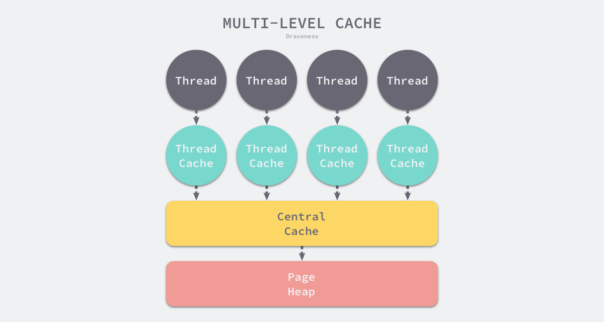
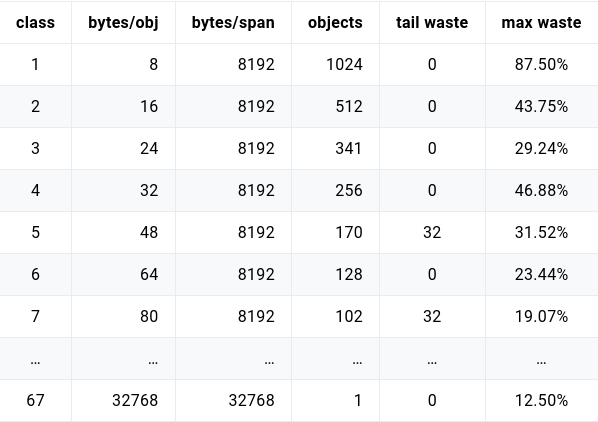
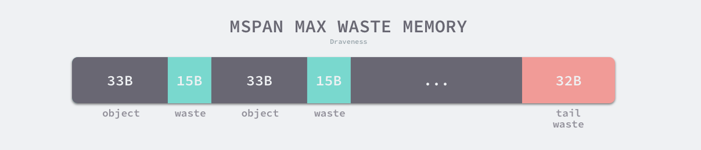
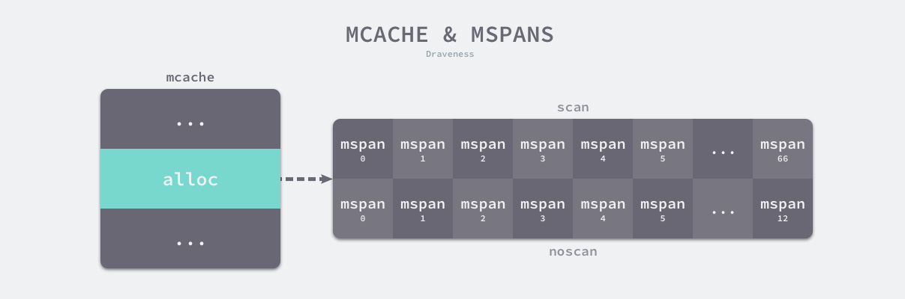

# 内存管理的组件
1. 组件  
    - 用户程序（Mutator）  
    - 分配器（Allocator）  
    - 收集器（Collector）  
2. 描述  
    - 当用户程序申请内存时，它会通过内存分配器申请新的内存，而分配器会负责从堆中初始化相应的内存区域。

# 内存分配器的分配方法（分配器种类）
1. 线性分配器
   - 特点：  
        - 执行速度较快，实现复杂度较低 
        - 无法重用被释放的内存  
        - 因需要配合垃圾回收，故C/C++ 等需要直接对外暴露指针的语言就无法使用该策略
   - 运行原理：  
       - 在内存中维护一个指向内存特定位置的指针，当用户程序申请内存时，分配器只需要检查剩余的空闲内存、返回分配的内存区域并修改指针在内存中的位置  
   - 内存回收：  
       - 因为线性分配器无法重用内存的特性，需要合适的垃圾回收算法配合使用。标记压缩（Mark-Compact）、复制回收（Copying GC）和分代回收（Generational GC）等算法可以通过拷贝的方式整理存活对象的碎片，将空闲内存定期合并，从而利用线性分配器的效率提升内存分配器的性能。
2. 空闲链表分配器  
   - 特点：
     - 可以重用已经被释放的内存  
     - 分配内存时需要遍历链表，时间复杂度是 O(n)
   - 运行原理：
     - 维护一个类似链表的数据结构，当用户程序申请内存时，空闲链表分配器会依次遍历空闲的内存块，找到足够大的内存，然后申请新的资源并修改链表。因为不同的内存块以链表的方式连接，所以此类分配器可重用内存，但是因为分配内存时需要遍历链表，所以它的时间复杂度就是 O(n)。  
   - 实现方式：
     - 首次适应（First-Fit）: 从链表头开始遍历，选择第一个大小大于申请内存的内存块；
     - 循环首次适应（Next-Fit）: 从上次遍历的结束位置开始遍历，选择第一个大小大于申请内存的内存块；
     - 最优适应（Best-Fit）: 从链表头遍历整个链表，选择最合适的内存块；
     - 隔离适应（Segregated-Fit）: 将内存分割成多个链表，每个链表中的内存块大小相同，申请内存时先找到满足条件的链表，再从链表中选择合适的内存块；隔离适应的分配策略减少了需要遍历的内存块数量，提高了内存分配的效率。如下图所示，该策略会将内存分割成由 4、8、16、32 字节的内存块组成的链表，当我们向内存分配器申请 8 字节的内存时，它会在上图中找到满足条件的空闲内存块并返回。(go语言的实现策略与此类似)    
    
  

# go语言的内存分配方式  
## 多级分配
1. 线程缓存分配（Thread-Caching Malloc，TCMalloc）是用于分配内存的的机制，它比 glibc 中的 函数还要快很多。Go 语言的内存分配器就借鉴了 TCMalloc 的设计实现高速的内存分配，它的核心理念是使用多级缓存将对象根据大小分类，并按照类别实施不同的分配策略。  
## 对象大小  
1. Go 语言的内存分配器会根据申请分配的内存大小选择不同的处理逻辑，运行时根据对象的大小将对象分成微对象、小对象和大对象三种。
2. 因为程序中的绝大多数对象的大小都在 32KB 以下，而申请的内存大小影响 Go 语言运行时分配内存的过程和开销，所以分别处理大对象和小对象有利于提高内存分配器的性能。
## 多级缓存
1. 内存分配器不仅会区别对待大小不同的对象，还会将内存分成不同的级别分别管理，TCMalloc 和 Go 运行时分配器都会引入线程缓存（Thread Cache）、中心缓存（Central Cache）和页堆（Page Heap）三个组件分级管理内存。  
    
2. 线程缓存属于每一个独立的线程，它能够满足线程上绝大多数的内存分配需求，因为不涉及多线程，所以也不需要使用互斥锁来保护内存，这能够减少锁竞争带来的性能损耗。当线程缓存不能满足需求时，就会使用中心缓存作为补充解决小对象的内存分配问题；在遇到 32KB 以上的对象时，内存分配器就会选择页堆直接分配大量的内存。  
3. 这种多层级的内存分配设计与计算机操作系统中的多级缓存也有些类似，因为多数的对象都是小对象，我们可以通过线程缓存和中心缓存提供足够的内存空间，发现资源不足时就从上一级组件中获取更多的内存资源。  
## 虚拟内存布局  
    在 Go 语言 1.10 以前的版本，堆区的内存空间都是连续的；但是在 1.11 版本，Go 团队使用稀疏的堆内存空间替代了连续的内存，解决了连续内存带来的限制以及在特殊场景下可能出现的问题。
### 线性内存  
1. Go 语言程序的 1.10 版本在启动时会初始化整片虚拟内存区域，spans、bitmap 和 arena 三个区域分别预留了 512MB、16GB 以及 512GB 的内存空间，这些内存并不是真正存在的物理内存，而是虚拟内存：
   
   - spans 区域存储了指向内存管理单元的指针，每个内存单元会管理几页的内存空间，每页大小为8KB；
   - bitmap 用于标识 arena 区域中的哪些地址保存了对象，位图中的每个字节都会表示堆区中的32字节是否包含空闲；
   - arena 区域是真正的堆区，运行时会将 8KB 看做一页，这些内存页中存储了所有在堆上初始化的对象；
2. 对于任意一个地址，我们都可以根据 arena 的基地址计算该地址所在的页数并通过 spans 数组获得管理该片内存的管理单元 runtime.mspan，spans 数组中多个连续的位置可能对应同一个 。  
3. Go语言在垃圾回收时会根据指针的地址判断对象是否在堆中，并通过上一段中介绍的过程找到管理该对象的 runtime.mspan。这些都建立在堆区的内存是连续的这一假设上。这种设计虽然简单并且方便，但是在 C 和 Go 混合使用时会导致程序崩溃：
    - 分配的内存地址会发生冲突，导致堆的初始化和扩容失败；
    - 没有被预留的大块内存可能会被分配给 C 语言的二进制，导致扩容后的堆不连续；
4. 线性的堆内存需要预留大块的内存空间，但是申请大块的内存空间而不使用是不切实际的，不预留内存空间却会在特殊场景下造成程序崩溃。虽然连续内存的实现比较简单，但是这些问题也没有办法忽略。
### 稀疏内存
1. 稀疏内存是 Go 语言在 1.11 中提出的方案，使用稀疏的内存布局不仅能移除堆大小的上限，还能解决 C 和 Go 混合使用时的地址空间冲突问题。不过因为基于稀疏内存的内存管理失去了内存的连续性这一假设，这也使内存管理变得更加复杂：
    
2. 如上图所示，运行时使用二维的 runtime.heapArena 数组管理所有的内存，每个单元都会管理 64MB 的内存空间：  
>
    type heapArena struct {
        bitmap       [heapArenaBitmapBytes]byte
        spans        [pagesPerArena]*mspan
        pageInUse    [pagesPerArena / 8]uint8
        pageMarks    [pagesPerArena / 8]uint8
        pageSpecials [pagesPerArena / 8]uint8
        checkmarks   *checkmarksMap
        zeroedBase   uintptr
    }
    该结构体中的 bitmap 和 spans 与线性内存中的 bitmap 和 spans 区域一一对应，zeroedBase 字段指向了该结构体管理的内存的基地址。上述设计将原有的连续大内存切分成稀疏的小内存，而用于管理这些内存的元信息也被切成了小块。
3. 不同平台和架构的二维数组大小可能完全不同，以 Linux 的 x86-64 架构为例，二维数组的一维大小会是 1，而二维大小是 4,194,304，因为每一个指针占用 8 字节的内存空间，所以元信息的总大小为 32MB。由于每个 runtime.heapArena 都会管理 64MB 的内存，整个堆区最多可以管理 256TB 的内存，这比之前的 512GB 多好几个数量级。
4. 由于内存的管理变得更加复杂，所涉及的改动对垃圾回收稍有影响，大约会增加 1% 的垃圾回收开销。

## 地址空间
1. 因为所有的内存最终都是要从操作系统中申请的，所以 Go 语言的运行时构建了操作系统的内存管理抽象层，该抽象层将运行时管理的地址空间分成以下四种状态：
   - None：内存没有被保留或者映射，是地址空间的默认状态
   - Reserved：运行时持有该地址空间，但是访问该内存会导致错误
   - Prepared：内存被保留，一般没有对应的物理内存访问，该片内存的行为是未定义的，可以快速转换到 Ready 状态
   - Ready：可以被安全访问
2. 每个不同的操作系统都会包含一组用于管理内存的特定方法，这些方法可以让内存地址空间在不同的状态之间转换，我们可以通过下图了解不同状态之间的转换过程：
    
3. 运行时中包含多个操作系统实现的状态转换方法，所有的实现都包含在以 mem_ 开头的文件中，以 Linux 操作系统对上图中方法的实现为例：
    - runtime.sysAlloc 会从操作系统中获取一大块可用的内存空间，可能为几百 KB 或者几 MB；
    - runtime.sysFree 会在程序发生内存不足（Out-of Memory，OOM）时调用并无条件地返回内存；
    - runtime.sysReserve 会保留操作系统中的一片内存区域，访问这片内存会触发异常；
    - runtime.sysMap 保证内存区域可以快速转换至就绪状态；
    - runtime.sysUsed 通知操作系统应用程序需要使用该内存区域，保证内存区域可以安全访问；
    - runtime.sysUnused 通知操作系统虚拟内存对应的物理内存已经不再需要，可以重用物理内存；
    - runtime.sysFault 将内存区域转换成保留状态，主要用于运行时的调试；
4. 运行时使用 Linux 提供的 mmap、munmap 和 madvise 等系统调用实现了操作系统的内存管理抽象层，抹平了不同操作系统的差异，为运行时提供了更加方便的接口，除了 Linux 之外，运行时还实现了 BSD、Darwin、Plan9 以及 Windows 等平台上抽象层。

## 内存管理组件
1. Go 语言的内存分配器包含内存管理单元、线程缓存、中心缓存和页堆几个重要组件，这几种组件对应的数据结构 runtime.mspan、runtime.mcache、runtime.mcentral 和 runtime.mheap
    
2. 所有的 Go 语言程序都会在启动时初始化上图所示的内存布局，每一个处理器都会分配一个线程缓存 runtime.mcache 用于处理微对象和小对象的分配，它们会持有内存管理单元 runtime.mspan
3. 每个类型的内存管理单元都会管理特定大小的对象，当内存管理单元中不存在空闲对象时，它们会从 runtime.mheap 持有的 134 个中心缓存 runtime.mcentral 中获取新的内存单元，中心缓存属于全局的堆结构体 runtime.mheap，它会从操作系统中申请内存。
4. 在 amd64 的 Linux 操作系统上，runtime.mheap 会持有 4,194,304 runtime.heapArena，每个 runtime.heapArena 都会管理 64MB 的内存，单个 Go 语言程序的内存上限也就是 256TB

### 内存管理单元
1. runtime.mspan 是 Go 语言内存管理的基本单元，该结构体中包含 next 和 prev 两个字段，它们分别指向了前一个和后一个 runtime.mspan：  

        type mspan struct {
            next *mspan
            prev *mspan
            ...
        }
2. 串联后的mspan结构体会构成双向链表，运行时会使用 runtime.mSpanList 存储双向链表的头结点和尾节点并在线程缓存以及中心缓存中使用。因为相邻的管理单元会互相引用，所以可以从任意一个结构体访问双向链表中的其他节点。
    

### 页和内存
1. 每个 runtime.mspan 都管理 npages 个大小为 8KB 的页，这里的页不是操作系统中的内存页，它们是操作系统内存页的整数倍，该结构体会使用下面这些字段来管理内存页的分配和回收：
   
        type mspan struct {
            startAddr uintptr // 起始地址
            npages    uintptr // 页数
            freeindex uintptr
            allocBits  *gcBits
            gcmarkBits *gcBits
            allocCache uint64
            ...
        }
    - startAddr 和 npages — 确定该结构体管理的多个页所在的内存，每个页的大小都是 8KB；
    - freeindex — 扫描页中空闲对象的初始索引；
    - allocBits 和 gcmarkBits — 分别用于标记内存的占用和回收情况；
    - allocCache — allocBits 的补码，可以用于快速查找内存中未被使用的内存；
2. runtime.mspan 会以两种不同的视角看待管理的内存，当结构体管理的内存不足时，运行时会以页为单位向堆申请内存：
    
3. 当用户程序或者线程向 runtime.mspan 申请内存时，它会使用 allocCache 字段，以对象为单位在管理的内存中快速查找待分配的空间：
    
4. 如果我们能在内存中找到空闲的内存单元会直接返回，当内存中不包含空闲的内存时，上一级的组件 runtime.mcache 会为调用 runtime.mcache.refill 更新内存管理单元以满足为更多对象分配内存的需求。

### 状态
1. 运行时会使用 runtime.mSpanStateBox 存储内存管理单元的状态 runtime.mSpanState：

        type mspan struct {
            ...
            state       mSpanStateBox
            ...
        }
2. 该状态可能处于 mSpanDead、mSpanInUse、mSpanManual 和 mSpanFree 四种情况。当 runtime.mspan 在空闲堆中，它会处于 mSpanFree 状态；当 runtime.mspan 已经被分配时，它会处于 mSpanInUse、mSpanManual 状态，运行时会遵循下面的规则转换该状态：
    - 在垃圾回收的任意阶段，可能从 mSpanFree 转换到 mSpanInUse 和 mSpanManual；
    - 在垃圾回收的清除阶段，可能从 mSpanInUse 和 mSpanManual 转换到 mSpanFree；
    - 在垃圾回收的标记阶段，不能从 mSpanInUse 和 mSpanManual 转换到 mSpanFree；
3. 设置 runtime.mspan 状态的操作必须是原子性的以避免垃圾回收造成的线程竞争问题。

### 跨度类
1. runtime.spanClass 是 runtime.mspan 的跨度类，它决定了内存管理单元中存储的对象大小和个数：

        type mspan struct {
            ...
            spanclass   spanClass
            ...
        }

2. Go 语言的内存管理模块中一共包含 67 种跨度类，每一个跨度类都会存储特定大小的对象并且包含特定数量的页数以及对象，所有的数据都会被预选计算好并存储在 runtime.class_to_size 和 runtime.class_to_allocnpages 等变量中：
    
3. 上表展示了对象大小从 8B 到 32KB，总共 67 种跨度类的大小、存储的对象数以及浪费的内存空间，以表中的第四个跨度类为例，跨度类为 5 的 runtime.mspan 中对象的大小上限为 48 字节、管理 1 个页、最多可以存储 170 个对象。因为内存需要按照页进行管理，所以在尾部会浪费 32 字节的内存，当页中存储的对象都是 33 字节时，最多会浪费 31.52% 的资源：

        (48−33)∗170+32/8192=0.31518
    
4. 除了上述 67 个跨度类之外，运行时中还包含 ID 为 0 的特殊跨度类，它能够管理大于 32KB 的特殊对象。
5. 跨度类中除了存储类别的 ID 之外，它还会存储一个 noscan 标记位，该标记位表示对象是否包含指针，垃圾回收会对包含指针的 runtime.mspan 结构体进行扫描。我们可以通过下面的几个函数和方法了解 ID 和标记位的底层存储方式：

        func makeSpanClass(sizeclass uint8, noscan bool) spanClass {
            return spanClass(sizeclass<<1) | spanClass(bool2int(noscan))
        }

        func (sc spanClass) sizeclass() int8 {
            return int8(sc >> 1)
        }

        func (sc spanClass) noscan() bool {
            return sc&1 != 0
        }
6. runtime.spanClass 是一个 uint8 类型的整数，它的前 7 位存储着跨度类的 ID，最后一位表示是否包含指针，该类型提供的两个方法能够帮我们快速获取对应的字段。

## 线程缓存
1. runtime.mcache 是 Go 语言中的线程缓存，它会与线程上的处理器一一绑定，主要用来缓存用户程序申请的微小对象。每一个线程缓存都持有 68 * 2 个 runtime.mspan，这些内存管理单元都存储在结构体的 alloc 字段中：
    
2. 线程缓存在刚刚被初始化时是不包含 runtime.mspan 的，只有当用户程序申请内存时才会从上一级组件获取新的 runtime.mspan 满足内存分配的需求。

### 初始化
1. 运行时在初始化处理器时会调用 runtime.allocmcache 初始化线程缓存，该函数会在系统栈中使用 runtime.mheap 中的线程缓存分配器初始化新的 runtime.mcache 结构体。初始化后的 runtime.mcache 中的所有 runtime.mspan 都是空的占位符 emptymspan：

        func allocmcache() *mcache {
            var c *mcache
            systemstack(func() {
                lock(&mheap_.lock)
                c = (*mcache)(mheap_.cachealloc.alloc())
                c.flushGen = mheap_.sweepgen
                unlock(&mheap_.lock)
            })
            for i := range c.alloc {
                c.alloc[i] = &emptymspan
            }
            c.nextSample = nextSample()
            return c
        }

### 替换
1. runtime.mcache.refill 会为线程缓存获取一个指定跨度类的内存管理单元，被替换的单元不能包含空闲的内存空间，而获取的单元中需要至少包含一个空闲对象用于分配内存。该方法会从中心缓存中申请新的 runtime.mspan 存储到线程缓存中，这也是向线程缓存插入内存管理单元的唯一方法：

        func (c *mcache) refill(spc spanClass) {
            s := c.alloc[spc]
            s = mheap_.central[spc].mcentral.cacheSpan()
            c.alloc[spc] = s
        }

### 微分配器
1. 线程缓存中还包含几个用于分配微对象的字段，tiny 、tinyOffset、local_tinyallocs 三个字段组成了微对象分配器，专门管理 16 字节以下的对象。微分配器只会用于分配非指针类型的内存， tiny 会指向堆中的一片内存，tinyOffset 是下一个空闲内存所在的偏移量，最后的 local_tinyallocs 会记录内存分配器中分配的对象个数：

        type mcache struct {
            tiny             uintptr
            tinyoffset       uintptr
            local_tinyallocs uintptr
        }

## 中心缓存
runtime.mcentral 是内存分配器的中心缓存，与线程缓存不同，访问中心缓存中的内存管理单元需要使用互斥锁。每个中心缓存都会管理某个跨度类的内存管理单元，它会同时持有两个 runtime.spanSet，分别存储包含空闲对象和不包含空闲对象的内存管理单元：

    type mcentral struct {
        spanclass spanClass
        partial  [2]spanSet
        full     [2]spanSet
    }
### 内存管理单元
1. 线程缓存会通过中心缓存的 runtime.mcentral.cacheSpan 方法获取新的内存管理单元，该方法的实现比较复杂，我们可以将其分成以下几个部分：
    - 调用 runtime.mcentral.partialSwept 从清理过的、包含空闲空间的 runtime.spanSet 结构中查找可以使用的内存管理单元；
    - 调用 runtime.mcentral.partialUnswept 从未被清理过的、有空闲对象的 runtime.spanSet 结构中查找可以使用的内存管理单元；
    - 调用 runtime.mcentral.fullUnswept 获取未被清理的、不包含空闲空间的 runtime.spanSet 中获取内存管理单元并通过 runtime.mspan.sweep 清理它的内存空间；
    - 调用 runtime.mcentral.grow 从堆中申请新的内存管理单元；
    - 更新内存管理单元的 allocCache 等字段帮助快速分配内存；
2. 首先我们会在中心缓存的空闲集合中查找可用的 runtime.mspan，运行时总是会先获取清理过的内存管理单元，后检查未清理的内存管理单元：

        func (c *mcentral) cacheSpan() *mspan {
            sg := mheap_.sweepgen
            spanBudget := 100

            var s *mspan
            if s = c.partialSwept(sg).pop(); s != nil {
                goto havespan
            }
            for ; spanBudget >= 0; spanBudget-- {
                s = c.partialUnswept(sg).pop()
                if s == nil {
                    break
                }
                if atomic.Load(&s.sweepgen) == sg-2 && atomic.Cas(&s.sweepgen, sg-2, sg-1) {
        			s.sweep(true)
                    goto havespan
                }
            }
            ...
        }
3. 当找到需要回收的内存单元时，运行时会触发 runtime.mspan.sweep 进行清理，如果在包含空闲空间的集合中没有找到管理单元，那么运行时尝试会从未清理的集合中获取：

        func (c *mcentral) cacheSpan() *mspan {
            ...
            for ; spanBudget >= 0; spanBudget-- {
                s = c.fullUnswept(sg).pop()
                if s == nil {
                    break
                }
                if atomic.Load(&s.sweepgen) == sg-2 && atomic.Cas(&s.sweepgen, sg-2, sg-1) {
        			s.sweep(true)
        			freeIndex := s.nextFreeIndex()
                    if freeIndex != s.nelems {
                        s.freeindex = freeIndex
                        goto havespan
                    }
        			c.fullSwept(sg).push(s)
                }
        	}
            ...
        }
4. 如果 runtime.mcentral 通过上述两个阶段都没有找到可用的单元，它会调用 runtime.mcentral.grow 触发扩容从堆中申请新的内存：

        func (c *mcentral) cacheSpan() *mspan {
            ...
            s = c.grow()
            if s == nil {
                return nil
            }
        havespan:
            freeByteBase := s.freeindex &^ (64 - 1)
            whichByte := freeByteBase / 8
            s.refillAllocCache(whichByte)
            s.allocCache >>= s.freeindex % 64
            return s
        }
5. 无论通过哪种方法获取到了内存单元，该方法的最后都会更新内存单元的 allocBits 和 allocCache 等字段，让运行时在分配内存时能够快速找到空闲的对象。

### 扩容
1. 中心缓存的扩容方法 runtime.mcentral.grow 会根据预先计算的 class_to_allocnpages 和 class_to_size 获取待分配的页数以及跨度类，并调用 runtime.mheap.alloc 获取新的 runtime.mspan 结构。获取了 runtime.mspan 后，会初始化 limit 字段并清除该结构在堆上对应的位图：

        func (c *mcentral) grow() *mspan {
            npages := uintptr(class_to_allocnpages[c.spanclass.sizeclass()])
            size := uintptr(class_to_size[c.spanclass.sizeclass()])

            s := mheap_.alloc(npages, c.spanclass, true)
            if s == nil {
                return nil
            }

            n := (npages << _PageShift) >> s.divShift * uintptr(s.divMul) >> s.divShift2
            s.limit = s.base() + size*n
            heapBitsForAddr(s.base()).initSpan(s)
            return s
        }

## 页堆
1. runtime.mheap 是内存分配的核心结构体，Go 语言程序会将其作为全局变量存储，而堆上初始化的所有对象都由该结构体统一管理，该结构体中包含两组非常重要的字段，其中一个是全局的中心缓存列表 central，另一个是管理堆区内存区域的 arenas 以及相关字段。页堆中包含一个长度为 136 的 runtime.mcentral 数组，其中 68 个为跨度类需要 scan 的中心缓存，另外的 68 个是 noscan 的中心缓存：
    
2. Go 语言所有的内存空间都由如下所示的二维矩阵 runtime.heapArena 管理，这个二维矩阵管理的内存可以是不连续的：
    
3. 除了 Windows 以外的 64 位操作系统中，每一个 runtime.heapArena 都会管理 64MB 的内存空间，如下所示的表格展示了不同平台上 Go 语言程序管理的堆区大小以及 runtime.heapArena 占用的内存空间：
    
### 初始化
1. 堆区的初始化会使用 runtime.mheap.init 方法，我们能看到该方法初始化了非常多的结构体和字段，不过其中初始化的两类变量比较重要：
    - spanalloc、cachealloc 以及 arenaHintAlloc 等 runtime.fixalloc 类型的空闲链表分配器；
    - central 切片中 runtime.mcentral 类型的中心缓存；
 
            func (h *mheap) init() {
                h.spanalloc.init(unsafe.Sizeof(mspan{}), recordspan, unsafe.Pointer(h), &memstats.mspan_sys)
                h.cachealloc.init(unsafe.Sizeof(mcache{}), nil, nil, &memstats.mcache_sys)
                h.specialfinalizeralloc.init(unsafe.Sizeof(specialfinalizer{}), nil, nil, &memstats.other_sys)
                h.specialprofilealloc.init(unsafe.Sizeof(specialprofile{}), nil, nil, &memstats.other_sys)
                h.arenaHintAlloc.init(unsafe.Sizeof(arenaHint{}), nil, nil, &memstats.other_sys)

                h.spanalloc.zero = false

                for i := range h.central {
                    h.central[i].mcentral.init(spanClass(i))
                }

                h.pages.init(&h.lock, &memstats.gc_sys)
            }